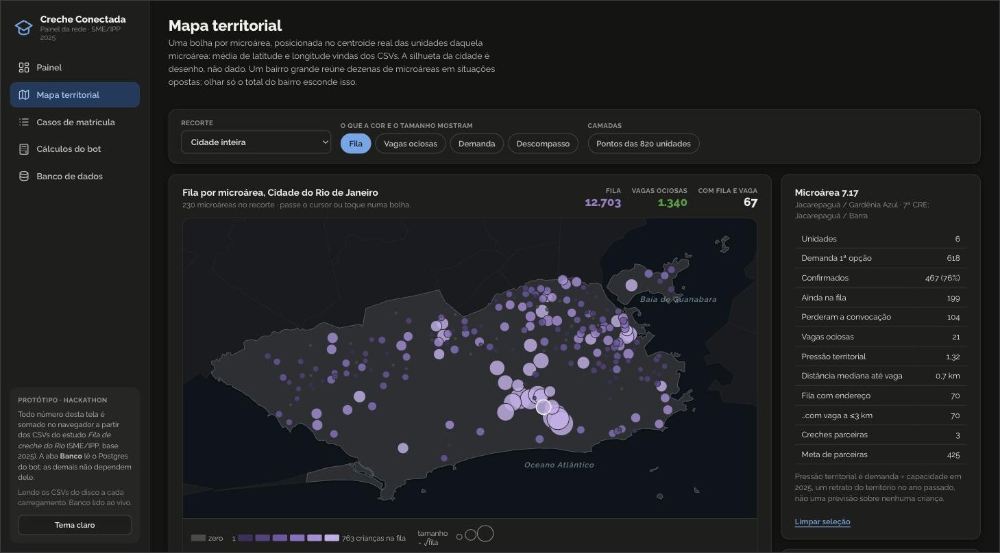
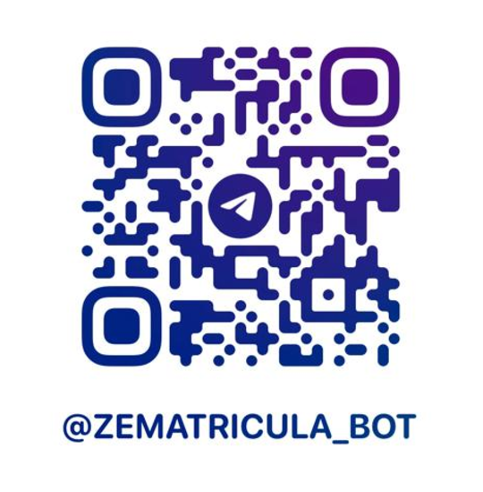
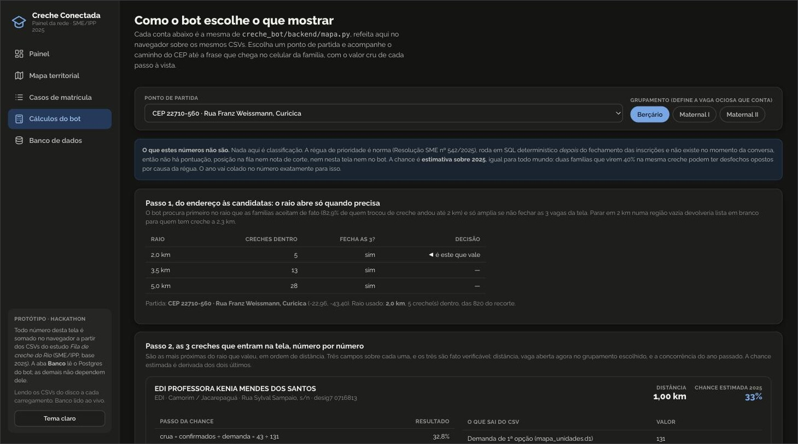
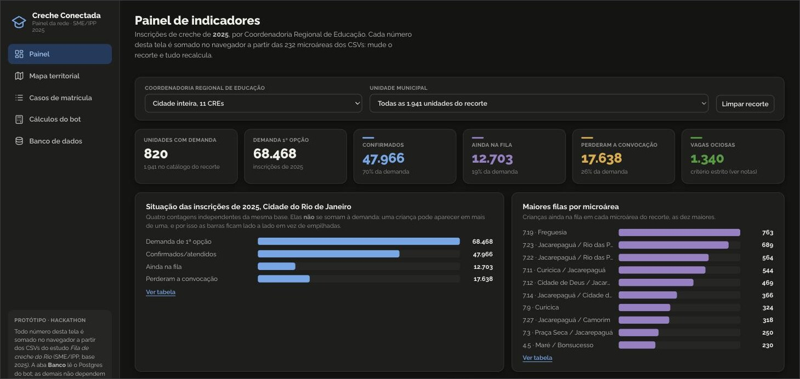

<div align="center">

<h4 align="center">
  
  &nbsp;&nbsp;Hackathon oficial da Claude Community · Rio de Janeiro Impact Lab
</h4>


# Zé Matrícula

**A inscrição em creche municipal do Rio, feita por conversa.**

Assistente da Matrícula Rio via Chat de IA. Reconhece o cadastro do ano passado, faz as perguntas da régua de
prioridade vigente, mostra as creches perto de casa com os números reais da rede, cobra o
documento que falta e avisa a cada mudança de etapa.

[](https://t.me/ZeMatricula_bot)
[](https://creche-conectada-production.up.railway.app)


<sub>Vídeos: [o bot](https://we.tl/t-1XhV4i8Dj0LxMJSC) · [o painel](https://we.tl/t-NQe0Oh3YHuLMU0o8)</sub>

</div>



## O problema

Da base histórica de 2021 a 2025 da rede municipal, 837.179 opções de inscrição:

| O que os dados mostram | O que o produto faz com isso |
|---|---|
| 48,9% declaram CadÚnico, **6,8% comprovam** | Captura o NIS e o documento **dentro da conversa** |
| 7,7% foram convocadas e perderam a vaga, a maior parte sem saber | Canal de contato e aviso a cada etapa |
| 27,9% das crianças de 2025 já constavam em 2024 | A busca começa pelo CPF do responsável |
| Entre 2023 e 2024, 3 das 13 perguntas da régua sobreviveram | A régua é dado do backend, nunca código |

Telegram primeiro. WhatsApp depois: os limites dele já valem em todo o código, então o flip é
troca de adaptador, não reescrita.

## Testar em três minutos

<div align="center">



### Aponte a câmera. O QR abre o [@ZeMatricula_bot](https://t.me/ZeMatricula_bot)

</div>

1. Abra o bot pelo QR acima, ou pelo link **[t.me/ZeMatricula_bot](https://t.me/ZeMatricula_bot)**.
2. `/start`. A primeira tela pergunta sobre a IA: toque em **"Seguir sem IA"**. O cadastro
   funciona igual com os textos à mão, e ninguém precisa de chave para avaliar o bot.
3. `/demo`, e escolha uma família. Cada uma entra na conversa já na tela que vale ver, sem
   passar pelas quatorze perguntas do cadastro do zero.

| Família do `/demo` | Onde a conversa cai |
|---|---|
| **Escolhendo creche** | a tela das creches perto do CEP: distância, vaga ociosa, concorrência e chance estimada |
| **Já inscrita** | inscrição efetivada, com `/status` e `/avancar` valendo |
| **Volta de 2025** | o CPF que o bot reconhece do processo do ano passado |
| **Sem demo, do zero** | sai da demonstração e começa a conversa normal |

Responder é tocar botão, mas digitar vale igual e **mandar áudio também**: o bot transcreve o
que você falou e segue a conversa no ponto em que estava. Documento pode ir como foto. Pergunta
fora do roteiro é respondida sem que ninguém perca o lugar na fila.

### Comandos do bot

| Comando | O que faz |
|---|---|
| `/start` | Começa, ou retoma de onde parou |
| `/ajuda` | Esta lista, dentro do bot |
| `/status` | A situação da inscrição |
| `/demo` | As três famílias de demonstração, e a saída delas |
| `/ia` | Liga a conversa com IA usando a **sua** chave da Anthropic, testada na hora. `/ia remover` desliga |
| `/apagar` | Apaga tudo o que o bot guardou sobre você |
| `/avancar` | Empurra a inscrição uma etapa, para ver a notificação chegar. Existe só enquanto o backend do município é simulado |

Áudio funciona. A transcrição é local (`faster-whisper`), roda dentro do próprio serviço e
está ligada no `@ZeMatricula_bot`. O modelo tem 460 MB e baixa uma vez, no primeiro boot. A voz
da família não vai para lugar nenhum: Claude não recebe áudio. Para rodar isso na sua máquina,
`pip install -e ".[audio]"`.

## O que o sistema não faz

**Não decide quem entra:** pontuação, posição na fila e nota de corte não existem em lugar
nenhum do código: a classificação é norma (Resolução SME nº 542/2025), roda em SQL
determinístico depois do fechamento das inscrições e, durante a conversa, não existe.

Sobre uma creche vão quatro números observados: distância, vaga ociosa agora, concorrência do
ano passado e a **chance estimada** (`confirmados ÷ demanda de 1ª opção` em 2025). Sempre com o
ano colado e nunca como "sua chance". Ver [D5 e D19](docs/DECISOES.md).



## Como funciona

A conversa é uma máquina de estados. É o que impede o bot de ficar preso em loop, e de quebra
faz a conversa rodar igual toda vez, o que a torna barata de testar. O mapa estado a estado
está em [ROTEIRO.md](docs/ROTEIRO.md).

```
IA_CONFIG → INICIO → PORTA ─ acompanhar ─→ CONSULTA_* (quem se inscreveu pelo site)
                          └ inscrever ──→ CONSENTIMENTO
  blocos 1-3  CADASTRO ⇄ CADASTRO_ANTERIOR (CPF do responsável no histórico)
  blocos 4-5  → CONTATO → RESUMO ⇄ CORRECAO
  blocos 6-7  → ENDERECO_CEP ⇄ CONFIRMA → HORARIO → ESCOLAS → CONFIRMA_ESCOLAS
  a régua     → CRIT_* (do processo vigente; é ela que gera a pendência)
  bloco 8     → PENDENCIAS → [RECEBER_DOC] → PROTOCOLO → ACOMPANHAR
```

Cada pasta troca por contrato congelado, e por isso as trilhas avançam em paralelo sem se
atropelar: 17 operações para o município, 21 para a persistência.

| Pasta | Responsabilidade |
|---|---|
| `canal/` | Adaptador de transporte: Telegram hoje, WhatsApp depois |
| `conversa/` | A máquina de estados, o cérebro do fluxo |
| `ia/` | Persona, classificação e transcrição local de áudio |
| `dados/` | Persistência. Ninguém fora daqui conhece banco |
| `backend/` | Fronteira com o município: histórico, régua, oferta, status |
| `notificacao/` | Outbox + catálogo de templates de mensagem proativa |
| `dominio/` | Vocabulário compartilhado, sem banco, sem canal, sem IA |

### Onde o Claude entra

`claude-haiku-4-5`, com a chave de quem conversa (`/ia`), em dois lugares: variar a fala do Zé
sem mudar o que ela promete, e classificar a mensagem que sai do roteiro (dúvida, correção, "me
perdi"). Sem chave o bot roda inteiro com os textos à mão ([D20](docs/DECISOES.md)). A IA
melhora a conversa e fica fora do caminho crítico.

Elegibilidade a ZDR está escrita como regra do repositório, com teste que a cobra. Imagem vai
base64 inline no `/v1/messages`, nada de Files, Batch ou conectores, e áudio nem chega ao
modelo. O prompt recebe a etapa e a pergunta que está no ar, nunca CPF, nome ou endereço.

### O painel

`creche-conectada.html` é a outra cara do mesmo sistema. Um arquivo só, que abre com duplo
clique e não pede build. O bot atende uma família; o painel mostra a rede por trás daquela
conversa, sobre os mesmos CSVs que o `BackendMapa` lê (232 microáreas, 820 unidades com
demanda em 2025). A vista *Cálculos* refaz em JavaScript a conta que `backend/mapa.py` faz em
Python, e as duas batem casa decimal por casa decimal. Da vista *Banco* sai contagem, nunca
conteúdo: [PAINEL.md](docs/PAINEL.md).



## Rodar local

```bash
git clone https://github.com/GuilhermeRozenblat/Hackathon-claude.git
cd Hackathon-claude
python -m venv .venv && source .venv/bin/activate
pip install -e ".[ia,dev]"
make memoria              # o bot inteiro, sem banco e sem DATABASE_URL
```

Com Postgres: `cp .env.example .env` (token do [@BotFather](docs/TELEGRAM.md) e a
[`DATABASE_URL`](docs/BANCO.md)), depois `make banco && make bot`.

| Comando | O que faz |
|---|---|
| `make bot` · `make memoria` · `make roteiro` | Com Postgres · sem tocar em disco · só as 3 escolas do mock |
| `make painel` · `make servidor` | Painel em `localhost:8000` · painel + webhook, como na hospedagem |
| `make test` · `make lint` | 351 testes, pytest puro · ruff |
| `make contratos` · `make fronteira` · `make seguranca` | Contratos congelados · SQL fora de `dados/` · segredo em log |

O Makefile tem o resto (`demo`, `banco`, `webhook`, `verificar`, e um alvo por trilha de teste).

## Estado

O roteiro roda de ponta a ponta, com cinco desvios deliberados que
[ROTEIRO.md](docs/ROTEIRO.md) lista. No ar pelo Railway, com o Postgres no Supabase e o Telegram
por webhook, num processo só.

O bloqueio que sobra é externo: o contrato HTTP do backend do município. Hoje no lugar dele
roda um mock que implementa a porta inteira, extração de documento inclusive. Do nosso lado
faltam duas coisas, o retry com backoff no outbox e o cofre de documentos.

## Documentação

| Documento | Sobre |
|---|---|
| [script-chatbot-ze-matricula.md](docs/script-chatbot-ze-matricula.md) · [ROTEIRO.md](docs/ROTEIRO.md) | O roteiro como produto o escreveu · o mesmo roteiro mapeado nos estados |
| [ARQUITETURA.md](docs/ARQUITETURA.md) · [DECISOES.md](docs/DECISOES.md) | O desenho e as restrições · as 23 decisões que custariam caro reverter |
| [MODELO_DADOS.md](docs/MODELO_DADOS.md) · [PAINEL.md](docs/PAINEL.md) | As 11 tabelas e o que não está no banco · as cinco vistas do painel |
| [BANCO.md](docs/BANCO.md) · [TELEGRAM.md](docs/TELEGRAM.md) · [HOSPEDAGEM.md](docs/HOSPEDAGEM.md) | Configurar o Supabase · criar o bot · publicar |
| [CLAUDE.md](CLAUDE.md) · [MODULOS.md](docs/MODULOS.md) | As regras invioláveis para qualquer agente · quem trabalha em quê |

Vários agentes mexem aqui ao mesmo tempo, e cada um só escreve nos arquivos que o `CLAUDE.md`
da sua pasta lista como seus: [canal](creche_bot/canal/CLAUDE.md) ·
[conversa](creche_bot/conversa/CLAUDE.md) · [ia](creche_bot/ia/CLAUDE.md) ·
[dados](creche_bot/dados/CLAUDE.md) · [backend](creche_bot/backend/CLAUDE.md) ·
[notificacao](creche_bot/notificacao/CLAUDE.md) · [dominio](creche_bot/dominio/CLAUDE.md)
