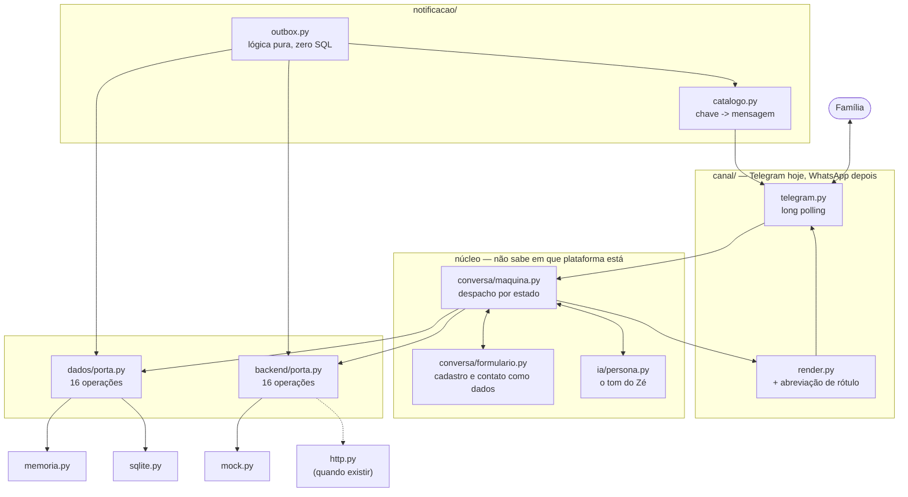

# Arquitetura — Zé Matrícula

> O desenho e o porquê. O código **existe e roda** — `make bot`.
>
> | Também leia | Para quê |
> |---|---|
> | [script-chatbot-ze-matricula.md](script-chatbot-ze-matricula.md) | O roteiro v2 — a fonte de verdade da conversa |
> | [docs/DECISOES.md](DECISOES.md) | As decisões que custariam caro reverter |
> | [docs/ROTEIRO.md](ROTEIRO.md) | Roteiro da conversa mapeado nos estados |
> | [MODULOS.md](MODULOS.md) | Quem faz o quê, e como as frentes não se atropelam |
> | [TELEGRAM.md](TELEGRAM.md) | Configurar o bot no @BotFather |

---

## Sumário

1. [Contexto](#1-contexto)
2. [As restrições que definem o desenho](#2-as-restrições-que-definem-o-desenho)
3. [Visão geral](#3-visão-geral)
4. [Fronteiras: quem é dono de quê](#4-fronteiras-quem-é-dono-de-quê)
5. [Os contratos congelados](#5-os-contratos-congelados)
6. [O roteiro da conversa](#6-o-roteiro-da-conversa)
7. [Notificação de status](#7-notificação-de-status)
8. [Privacidade como código](#8-privacidade-como-código)
9. [O caminho até o WhatsApp](#9-o-caminho-até-o-whatsapp)
10. [Verificação](#10-verificação)
11. [Fora de escopo, de propósito](#11-fora-de-escopo-de-propósito)
12. [Fontes](#12-fontes)

---

## 1. Contexto

Famílias perdem vaga de creche por burocracia: formulário confuso, documento faltando, e
depois nenhum retorno sobre o andamento. O **Zé Matrícula** substitui isso por uma
conversa: reconhece o cadastro do ano passado, coleta o que falta, faz as perguntas da
régua de prioridade, mostra as creches próximas, cobra a comprovação e avisa a cada
mudança de etapa.

Os números que orientam o desenho, da base histórica de 2021 a 2025 (837.179 opções):

| Fato | Consequência no desenho |
|---|---|
| 48,9% declaram CadÚnico, 6,8% comprovam — e 93,8% terminam com pontuação validada zero | Capturar o NIS dentro da conversa é a razão de existir do projeto |
| 7,7% foram convocadas e perderam a vaga, a maior parte sem saber que foi chamada | O canal de contato e as notificações R2/R3 |
| 27,9% das crianças de 2025 já constavam em 2024 | A busca começa pelo CPF do responsável, e o cadastro anterior preenche tudo |
| 77,8% das linhas "Cancelado pelo sistema" são de quem **foi atendido** | A consulta mostra um desfecho calculado, nunca o status bruto |
| Entre 2023 e 2024, 3 das 13 perguntas da régua sobreviveram | A régua é dado do backend, nunca código |

Validação no **Telegram** (grátis, sem aprovação, mensagem proativa livre). Depois flip
para o **WhatsApp**, que é onde o público está.

**Decisões de escopo:**

| | |
|---|---|
| Linguagem | Python 3.12, **sem dependência para rodar** |
| Canal hoje | Telegram, long polling — roda no localhost |
| Dados do município | `BackendMock` com os dados do roteiro v2; o backend real é de outro time |
| Persistência | `RepositorioSQLite` por padrão; `RepositorioMemoria` disponível |
| Escolha da vaga | Lista **ordenada** de preferências, montada em toques |
| Régua de prioridade | Dado do backend, montada em tempo de execução |
| Seleção de quem entra | **Não é nossa.** Cadastramos e informamos; quem aloca é o município |
| Voz | Transcrição **local** (`faster-whisper`), opcional. A voz não sai da máquina |
| Redação | Textos escritos à mão; Claude é opcional e cai para eles se falhar |

---

## 2. As restrições que definem o desenho

### 2.1 O flip Telegram → WhatsApp

| | Telegram Bot API | WhatsApp Cloud API |
|---|---|---|
| Mensagem proativa | Livre, a qualquer hora, grátis | Só **template aprovado pela Meta**, pago |
| Janela de conversa | Não existe | **24h** após a última mensagem do usuário |
| Texto livre | Sempre | Só dentro da janela de 24h |
| Botões | Dezenas (inline keyboard) | **Máx. 3** botões de resposta |
| Lista de opções | Livre | **Máx. 10** itens |
| Figurinhas | Nativas, pack próprio, `file_id` reutilizável | WebP 512×512, ≤100KB estático / ≤500KB animado, **só dentro da janela** |
| Download de mídia | 20 MB (`getFile`) | 100 MB |
| Aprovação para começar | `@BotFather`, 2 minutos | Verificação Meta Business + nome + templates (~24h cada) |
| Custo por notificação | R$ 0 | ~R$ 0,04–0,05 (utility, Brasil) |
| Rate limit | ~1 msg/s por chat, ~30/s global | Cotas por qualidade do número |
| Infra mínima | **Long polling — roda no localhost** | Webhook HTTPS público obrigatório |

**A consequência que mata projeto ingênuo:** a feature central — "avisar quando o status
mudar" — é business-initiated. No WhatsApp, fora da janela de 24h, ela **não pode ser um
texto gerado pela IA**. Tem que ser um template registrado antes, com variáveis, sem
figurinha, sem improviso.

**A regra que salva:** toda mensagem proativa é `(ChaveTemplate, variáveis)` desde a V1 —
nunca uma string pronta. No Telegram a chave vira texto divertido com figurinha; no
WhatsApp vira o template aprovado. Quem emite o evento não sabe a diferença.

**Como manter a personalidade no WhatsApp:** o template é mínimo e traz um botão
("Novidade sobre a vaga do(a) {nome} 👀 — toca aqui"). O toque **abre uma janela de 24h
nova**, e dentro dela o bot solta o texto animado e as figurinhas de graça. A persona vive
no caminho de resposta; o template só bate na porta.

> ⚠️ A Meta anunciou que a partir de **1º/10/2026** mensagens de serviço e utility dentro
> da janela de 24h voltam a ser cobradas. Reconfirmar a regra vigente antes de projetar
> custo do WhatsApp.

### 2.2 Privacidade dos documentos — isso vira código

Da documentação oficial da Anthropic, só o que é acionável:

- **A Anthropic não treina modelos com dados de API comercial.** É contratual (Commercial
  Terms), não configuração. ✅ Requisito já atendido.
- **A Messages API (`/v1/messages`) é elegível a ZDR. A Files API (`/v1/files`) não é.**
  → **Documento vai como base64 inline na Messages API. Nunca `client.files.*`.**
- Também **não** elegíveis a ZDR: Batch API, code execution, MCP connector, Managed
  Agents, Agent Skills. → Nenhum pode tocar dado de usuário.
- **Fable 5 e Mythos 5 são "Covered Models": exigem retenção de 30 dias e não existem sob
  ZDR.** → Usar `claude-haiku-4-5`. Nunca Fable/Mythos aqui.
- ZDR é acordo por organização, via time comercial — não dá para ligar sozinho.
- Mesmo com ZDR, conteúdo sinalizado pelo sistema de segurança pode ser retido até 2 anos.
  **Por isso minimização é o controle de verdade**, não a política.

Seguir essas quatro regras na V1 significa que ligar ZDR depois é uma conversa comercial —
zero refatoração.

**Minimização na prática:** redimensionar a imagem para ~1568px no maior lado antes de
enviar, extrair uma vez, guardar estruturado, e **nunca reenviar a imagem** nos turnos
seguintes.

### 2.3 LGPD art. 14 — dado de criança

Tratamento de dado de criança exige **consentimento específico e em destaque, dado por um
dos pais ou responsável**. Isso é tabela de primeira classe, não checkbox. **Nenhum
documento é aceito antes do consentimento registrado** — guarda no código, categoria
"nunca simplificar".

---

## 3. Visão geral



Uma regra rege o diagrama: **o núcleo nunca sabe em qual plataforma está, nem qual banco
está embaixo, nem de onde vêm os dados do município.** Ele recebe `MensagemEntrada`,
devolve `MensagemSaida`, e conversa com duas portas.

---

## 4. Fronteiras: quem é dono de quê

O sistema tem três frentes que avançam em paralelo. Elas se tocam em **dois arquivos
congelados**, e em mais nenhum.

```
        ┌──────────────────────────────────────────────┐
        │  canal/ · conversa/ · ia/ · notificacao/      │  Guilherme
        └───────┬──────────────────────────┬───────────┘
                │                          │
      dados/porta.py               backend/porta.py     ← CONGELADOS
      16 operações                 16 operações
                │                          │
    ┌───────────┴────────────┐  ┌──────────┴───────────────────┐
    │ dados/                 │  │ backend/                     │
    │ memoria.py · sqlite.py │  │ mock.py · http.py            │
    │ estado NOSSO           │  │ dados do MUNICÍPIO           │
    │ outra pessoa           │  │ outro time, outra máquina    │
    └────────────────────────┘  └──────────────────────────────┘
```

**A regra é verificável, não combinada.** `make fronteira` varre o pacote e falha se
`sqlite3`, `SELECT`, `cursor` ou `session` aparecerem fora de `dados/`. Comprovado contra
cinco formas de vazamento.

**Consequência prática.** `REPOSITORIO=memoria make bot` roda o bot inteiro sem tocar em
disco: quem trabalha no chat nunca é bloqueado por uma refatoração no banco. E a bateria
roda parametrizada contra as duas implementações de repositório — se divergirem, o teste
acusa antes da produção.

### 4.1 O que o backend do município entrega

Dezesseis operações, em cinco grupos:

| Grupo | Operações |
|---|---|
| **Processo** | `periodo_de_inscricao()` · `data_do_resultado()` · `data_de_corte()` · `criterios_do_processo()` |
| **Histórico** | `buscar_por_responsavel(cpf)` → `CadastroAnterior \| None` |
| **Endereço** | `resolver_cep(cep, numero)` → `Endereco \| None` |
| **Oferta** | `escolas_proximas(endereco, grupamento, horario, n)` — top N **já ordenado** |
| **Inscrição** | `validar_nis()` · `inscrever()` · `enviar_documento()` · `pontos_de_entrega()` |
| **Consulta** | `consultar_por_numero()` · `consultar_por_nome()` · `consultar_por_responsavel()` |
| **Notificação** | `situacao(numero)` · `mudancas_desde(marca)` |

O bot **não reordena, não recalcula e não decide**. Ele conversa e narra.

Três dessas operações merecem atenção:

- **`criterios_do_processo()`** devolve a régua vigente. Entre 2023 e 2024 só 3 das 13
  perguntas sobreviveram e o teto caiu de 465 para 100 pontos — régua no código quebra na
  virada do ano, no meio do período de inscrição. Ver [D15](DECISOES.md).
- **`buscar_por_responsavel(cpf)`** é pelo CPF do **adulto**, nunca da criança. Exigir CPF
  de criança de 0 a 3 anos no primeiro turno derruba família na porta. Ver [D12](DECISOES.md).
- **`resolver_cep(cep, numero)`** é o único caminho para bairro, logradouro e coordenadas.
  Campo livre gerou 1.608 grafias para ~925 bairros. Ver [D13](DECISOES.md).

### 4.2 Nem probabilidade, nem pontuação, nem posição na fila

O sistema não seleciona quem entra: quem aloca é o município, por norma (Resolução SME nº
542/2025), em SQL determinístico que roda **depois do fechamento das inscrições**. No
momento da conversa a classificação literalmente não existe — então não há o que mostrar,
nem "probabilidade de conseguir a vaga", nem posição na fila, nem nota de corte.

Sobre uma creche, o bot mostra os três fatos verificáveis: **distância**, **vaga ociosa
agora** e **concorrência do ano passado** (`Concorrencia.familias_por_vaga`, com `ano`
obrigatório no tipo, para a UI ser forçada a dizer de quando é o número).

A nota de corte foi cortada de propósito na v2: o teto da régua foi 465 pontos em 2023 e
100 em 2024, e pontuação não é comparável entre anos. Detalhes em [D5](DECISOES.md).

---

## 5. Os contratos congelados

Quatro arquivos que ninguém edita sem PR próprio, porque todo mundo depende deles.

### 5.1 `canal/tipos.py` — o coração do flip

Os limites do WhatsApp entram como `assert` no construtor, e valem também no código do
Telegram, que aceitaria muito mais:

```python
def __post_init__(self) -> None:
    assert self.texto.strip(), "mensagem sem texto"
    assert len(self.botoes) <= 3,  "WhatsApp aceita 3 botões..."
    assert len(self.lista)  <= 10, "WhatsApp aceita 10 itens"
    assert not (self.botoes and self.lista), "botões e lista são exclusivos"
    for b in self.botoes:
        assert len(b.rotulo) <= 20, "rótulo > 20 chars..."
```

**Já se pagou duas vezes.** Rejeitou `Creche Jardim das Flores` (24 caracteres) e forçou o
redesenho do painel de escolas, que queria 5 botões. Ver [D1](DECISOES.md).

A abreviação mora aqui, e não no render: o `assert` roda no **construtor**, antes de
qualquer renderização. Quem produz o botão abrevia — `botoes_nomeados()` cuida disso e
numera se dois nomes colidirem.

**Identidade:** `id_externo` nunca é chave primária. `Contato` tem UUID próprio e
`identidade_canal(contato_id, canal, id_externo)` liga aos canais. É isso que faz a mesma
pessoa migrar do Telegram para o WhatsApp sem recomeçar o cadastro.

**Formatação:** o texto é puro. `MarkdownV2` do Telegram e `*negrito*` do WhatsApp são
dialetos incompatíveis, e o escape do Telegram é fonte clássica de bug.

### 5.2 `dominio/tipos.py` — vocabulário compartilhado

Carrega os dois padrões que sustentam o sistema:

**Vocabulário aberto, comportamento fechado.** `Etapa.codigo` é `str` livre — o município
define quais etapas existem. `Etapa.tipo` é `Literal` de seis valores — nós definimos o
que fazer com cada uma. Etapa nova que caia num tipo conhecido funciona sem código novo.
Ver [D4](DECISOES.md).

**Régua do processo é dado, não código.** `Criterio` é uma lista que o backend devolve —
pesos, ordem e texto mudam todo ano. Ver [D15](DECISOES.md).

**Duas visões da inscrição, de propósito.** `Situacao`/`Etapa` é o que MUDA e dispara
notificação. `Desfecho` é o que a família VÊ ao consultar: um estado só, calculado por
`desfecho_entre()` como a melhor situação entre as opções dela. Ver [D14](DECISOES.md).

**O que não existe no tipo: pontuação e posição na fila.** Não há campo para elas, então
não há como uma tela mostrá-las por acidente. Ver [D5](DECISOES.md).

Duas guardas que valem ouro no `__post_init__` de `Etapa`: `acao_presencial` sem endereço
e `convocacao` sem prazo são erro de tipo. Mandar a família à creche sem dizer onde, ou
deixar um prazo vencer em silêncio, são os dois piores erros que este bot pode cometer.

### 5.3 `dados/porta.py` e `backend/porta.py`

Descritas na §4. A diferença entre elas é de dono e de natureza: uma guarda o **nosso**
estado, a outra busca os dados do **município**.

### 5.4 `notificacao/chaves.py`

Nove chaves de template — e cada uma vira um template submetido à Meta na Fase 3, com
~24h de aprovação. **Mudar este enum é grátis agora e caro depois.**

`CONVOCACAO` e `LEMBRETE_CONVOCACAO` são a correção direta do maior vazamento do processo:
em 2025, 5.519 famílias (7,7%) foram convocadas e perderam a vaga, e a maior parte nunca
soube que foi chamada. Hoje "não foi avisada" e "foi avisada e desistiu" viram o mesmo
registro no banco — só a primeira é problema que o bot resolve.

`POR_TIPO_ETAPA` mapeia `TipoEtapa` → `ChaveTemplate` numa tabela, não numa cadeia de
`if`. Um teste garante que todo tipo de etapa tem template.

---

## 6. O roteiro da conversa

O roteiro é [`script-chatbot-ze-matricula.md`](script-chatbot-ze-matricula.md); o mapa
dele contra os estados do código está em [`docs/ROTEIRO.md`](ROTEIRO.md) — com diagrama,
tabela bloco-a-bloco e como testar cada caminho.

Quatro coisas que valem registrar aqui:

**Os blocos de cadastro são dados.** "Uma pergunta por mensagem" é literalmente uma lista
de perguntas: `conversa/formulario.py` é uma tupla de `Campo` por lista, e a ramificação é
uma lambda `pular_se`. Como código seriam 15 handlers quase idênticos. Produto edita sem
tocar em lógica. Ver [D8](DECISOES.md).

**O bloco de critérios NÃO é dado nosso.** Ele é montado em tempo de execução a partir de
`backend.criterios_do_processo()`, agrupado por `Criterio.grupo`. `passos/criterios.py`
define só a **forma** de cada turno, que é estável. Ver [D15](DECISOES.md).

**A ordem de preferência é montada em toques.** O roteiro pede "seleção múltipla
ordenável" e o WhatsApp não tem esse widget. Cada toque acrescenta uma preferência, o bot
confirma a posição e mostra o que sobrou — toda tela cabe em 3 botões. Ver
[D6](DECISOES.md).

**Dado sensível tem consentimento separado, um turno só, e nunca é ecoado.** Saúde,
violência doméstica, uso de substâncias e situação prisional são dado sensível (LGPD art.
5º II e art. 11). Consentimento próprio, opção de pular, nunca bloqueante — e o eco de
confirmação não vale aqui, porque o histórico fica no aparelho da família. Ver
[D7](DECISOES.md).

**Fora do roteiro, duas coisas acontecem antes de qualquer passo.** Áudio vira texto por
transcrição local, para que nenhum passo saiba que existe voz; e pergunta solta é
respondida sem mexer no estado, com cota por contato e o texto do cidadão tratado como
dado, nunca como instrução. Ver [D17](DECISOES.md).

---

## 7. Notificação de status

```
mudança de status → INSERT em outbox (mesma transação) → worker drena → enviar()
```

Transactional outbox: uma tabela e um loop. Sem Kafka, sem Celery, sem Redis na V1.
Garante entrega e sobrevive a restart.

`notificacao/catalogo.py` mapeia a chave para cada canal:

| `ChaveTemplate` | Telegram | WhatsApp (Fase 3) |
|---|---|---|
| `INSCRICAO_CONFIRMADA` | texto + figurinha `festa` | template + botão |
| `ETAPA_AVANCOU` | texto + figurinha `comemorando` | template + botão |
| `DOCUMENTO_PENDENTE` (R1) | texto + figurinha `atencao` | template + botão |
| `ACAO_PRESENCIAL` | texto + `sendVenue` com o pino | template + botão |
| `CONVOCACAO` (R2) | texto + botões `Confirmar vaga` / `Não vou poder` | template + botões |
| `LEMBRETE_CONVOCACAO` (R3) | reenvio quando o R2 não foi lido em 24h | template + botões |
| `RESULTADO_CLASSIFICADA` (R4) | texto + figurinha `festa` | template + botão |
| `RESULTADO_NAO_CLASSIFICADA` | texto acolhedor + `Quero ser avisada` | template + botão |
| `LEMBRETE_INCOMPLETO` | texto + `Continuar` | template + botão |

**Nunca uma string livre na outbox** — só a chave e as variáveis. É isso que faz o flip
custar um arquivo.

V1: o comando `/avancar` no próprio chat empurra a inscrição uma etapa e deixa o worker
entregar de verdade. Sai junto com o `BackendMock`.

### 7.1 A lacuna do CRAS

Quando a família entrega os documentos num CRAS, eles ainda seguem para a creche — e hoje
**ninguém avisa quando esse trajeto termina**. É lacuna do processo, não do código, e foi
apontada no próprio roteiro.

Não dá para inventar a integração. Dá para não deixar a família no escuro: o bot avisa
explicitamente que o trajeto existe, que leva alguns dias, e que ele avisa quando a creche
confirmar. Há teste garantindo que esse aviso não some do texto.

Quando a confirmação existir, ela entra como mais uma etapa do backend — sem código novo,
porque o despacho é por `etapa.tipo` e não por `codigo`. Ver [D4](DECISOES.md) e
[D10](DECISOES.md).

---

## 8. Privacidade como código

`ia/redacao.py` é o único lugar que fala com a Anthropic, e carrega as regras no topo:

```python
MODELO = "claude-haiku-4-5"   # nunca Fable/Mythos: Covered Models, sem ZDR

# REGRAS INVIOLÁVEIS (elegibilidade a ZDR):
#   - imagem vai inline em base64 no /v1/messages
#   - proibido: client.files.*, batches, code_execution, MCP, Managed Agents
```

Um teste faz `grep` em `ia/` procurando `files.upload|batches|code_execution` e falha se
alguém adicionar. Cinco linhas, e é o que impede a regra de virar comentário morto.

Demais controles:

| Controle | V1 |
|---|---|
| Documentos em repouso | **Não persistimos documento.** Extrai, guarda estruturado, descarta os bytes — ver [D9](DECISOES.md) |
| Voz | Transcrição roda **local** (`faster-whisper`). Áudio não sai da máquina e não vai para nenhuma API |
| Entrada livre perto de prompt | Delimitada, declarada como dado, e a resposta filtrada antes de entrar na conversa |
| Retenção | Quando o cofre existir: `expira_em` + job de expurgo. Hoje não há o que expirar |
| Logs | Só IDs. Nunca conteúdo de mensagem, bytes de arquivo ou CPF. Filtro de redação no logger |
| Consentimento | Bloqueante, com versão do texto gravada |
| Direito de eliminação (LGPD) | `apagar_tudo(contato_id)` **desde a V1** — incluir depois é bem mais caro |
| Segredos | `.env` no `.gitignore`, `.env.example` versionado |
| Minimização | Imagem redimensionada antes de enviar; extração uma vez; imagem nunca reenviada |

---

## 9. O caminho até o WhatsApp

**O que NÃO muda** (é o ponto do desenho todo): `dominio/`, `conversa/`, `ia/`,
as chaves do catálogo, os tipos de domínio e o modelo canônico de mensagem.

**O que muda:**

| Área | V1 | VFINAL |
|---|---|---|
| Canal | Telegram, long polling | + `canal/whatsapp.py`, webhook FastAPI, templates aprovados |
| Hospedagem | localhost | Railway/Fly — HTTPS público é obrigatório no WhatsApp |
| Arquivos | disco cifrado | S3/R2 com SSE-KMS, URL pré-assinada de curta duração |
| Outbox | loop em processo | fila com retry exponencial e DLQ |
| Extração | mock | backend do município |
| Status | `/avancar` com o mock | backend real do município |
| Idempotência | id de mensagem | obrigatória — o WhatsApp reentrega webhook |
| Privacidade | termos comerciais padrão | **ZDR negociado** com a Anthropic |
| Observabilidade | logs | métricas de funil, tracing, alerta de erro |

**Ordem do flip:** (1) verificação Meta Business e número; (2) submeter os templates do
enum `ChaveTemplate` — ~24h cada, **começar cedo, é o caminho crítico**; (3) subir com
HTTPS; (4) escrever `canal/whatsapp.py`; (5) subir as figurinhas WebP e guardar os
`media_id`; (6) rodar os dois canais em paralelo. Só o passo 4 é código, e é pequeno — é
para isso que serve tudo acima.

---

## 10. Verificação

```bash
python -m venv .venv && source .venv/bin/activate
pip install -e ".[dev]"        # só para os testes; rodar não precisa de nada

make test         # tudo, contra as duas implementações de repositório
make fronteira    # falha se persistência vazar para fora de dados/
make lint
make bot          # precisa do token — veja TELEGRAM.md
```

### O que os testes cobrem

| Teste | O que quebraria em produção sem ele |
|---|---|
| 4 botões falha; nenhuma tela estoura os limites do WhatsApp | O flip, três meses depois, com o fluxo todo construído por cima |
| Rótulos abreviados continuam distinguíveis | Família escolhe a creche errada sem saber |
| Persistência não vaza de `dados/` | Refatoração do banco quebra quem mexe no chat |
| Domínio não importa infraestrutura; fakes satisfazem os Protocols | Divergência só apareceria na integração |
| `ia/` não usa API fora de ZDR | Documento de criança retido além do necessário |
| Etapa presencial exige endereço; convocação exige prazo | Família mandada à creche sem saber onde; prazo vencendo em silêncio |
| Todo `TipoEtapa` tem template | Etapa nova do backend fica sem notificação |
| Bot nunca promete vaga nem pontuação; painel nunca mostra nota de corte | Expectativa falsa numa família esperando creche |
| Painel mostra só fato verificável | Idem, pelo lado do que É mostrado |
| Sem consentimento nada é alcançável | LGPD art. 14 |
| Desfecho é a melhor situação entre as opções | Família atendida vendo "cancelado" em 4 das 5 escolhas |
| Resposta sensível nunca é ecoada | Histórico do chat fica no aparelho da família |
| Régua do processo é dado, não código | A virada do ano quebra o bot no meio do período de inscrição |
| Grupamento sai da idade na data de corte; fora da faixa falha cedo | Família descobrindo no resultado que nunca esteve no processo |
| NIS comprova as duas perguntas; sem o NIS a inscrição segue | O turno que existe para capturar a comprovação virando parede |
| Aviso do trajeto CRAS → creche, nos dois passos | Família no escuro depois de entregar documento |
| Documento ilegível não vira comprovação | Dado errado no cadastro |
| Ordem de preferência = ordem dos toques | Inscrição na creche errada |
| Dado pessoal não vai junto com a dúvida; pergunta não escapa do bloco de dado | Prompt dobrado por texto de usuário; PII num prompt sem precisar |
| Cota corta o chat aberto como botão de gastar | Conta da API de quem publicou o bot |
| Número mexido reprova a reescrita | Claude "melhorando" um CPF ou um protocolo na tela |
| Áudio longo nem é baixado; sem transcritor o bot avisa | Polling travado para todo mundo por um áudio de cinco minutos |
| Token não sobrevive ao log nem ao traceback | Quem tem o token controla o bot |

### Fim a fim, no Telegram real

1. `/start` → "Quero inscrever" → aceite o consentimento.
2. CPF do responsável `529.982.247-25` → o cadastro do ano passado aparece inteiro.
   Qualquer outro CPF válido → preenchimento completo.
3. CEP `22710-560` e número → confirme o endereço → integral → a régua de prioridade.
4. Escolha as creches em toques, depois "Pronto" → resumo → enviar.
5. Mande a foto do documento que ficou pendente → protocolo.
6. `/avancar` algumas vezes → as notificações R1 a R4 chegam sozinhas.
7. Mate o processo no meio e suba de novo → a conversa continua de onde parou.
8. `/status` → o bloco C, com o desfecho calculado.
9. `/apagar` → tudo some, sem deixar órfão.

---

## 11. Fora de escopo, de propósito

| Deixado de fora | Quando adicionar |
|---|---|
| Adapter de WhatsApp | Depois que o Telegram validar o fluxo com famílias reais |
| Postgres, Alembic | Quando mais de um processo escrever — trabalho em paralelo |
| Cofre de documentos cifrado | Quando a creche exigir o arquivo original guardado |
| Fila (Redis/Celery) | Quando o loop da outbox não der conta |
| Figurinhas próprias | Quando houver pack no @Stickers; hoje é emoji |
| Painel admin | Quando alguém que não é dev precisar mudar status |
| Previsão de admissão, pontuação, posição na fila | Nunca. Não somos o alocador, e a classificação nem existe durante a conversa |
| Retorno CRAS → creche | Depende de processo, não de código — ver [D10](DECISOES.md) |

---

## 12. Fontes

- [API and data retention — Claude Platform Docs](https://platform.claude.com/docs/en/manage-claude/api-and-data-retention)
- [Updates to Consumer Terms and Privacy Policy — Anthropic](https://www.anthropic.com/news/updates-to-our-consumer-terms)
- [Bots FAQ — Telegram](https://core.telegram.org/bots/faq)
- [Telegram Bot API Limits 2026](https://www.conferbot.com/limits/telegram)
- [Media — WhatsApp Business Platform, Meta for Developers](https://developers.facebook.com/documentation/business-messaging/whatsapp/business-phone-numbers/media)
- [Pricing on the WhatsApp Business Platform — Meta](https://developers.facebook.com/documentation/business-messaging/whatsapp/pricing)
- [WhatsApp Business API Pricing in Brazil 2026 — Message Central](https://www.messagecentral.com/blog/whatsapp-business-api-pricing-brazil)
- [WhatsApp Business Platform 24 Hour Rule — Enchant](https://www.enchant.com/whatsapp-business-platform-24-hour-rule)
- [Supported message types on WhatsApp Business API — SleekFlow](https://help.sleekflow.io/en_US/whatsapp/supported-message-types-on-whatsapp-business-api-cloud-a)
- [ViaCEP](https://viacep.com.br/)
- [Nominatim Usage Policy — OpenStreetMap](https://operations.osmfoundation.org/policies/nominatim/)
- [sendVenue — Telegram Bot API](https://core.telegram.org/bots/api#sendvenue)
