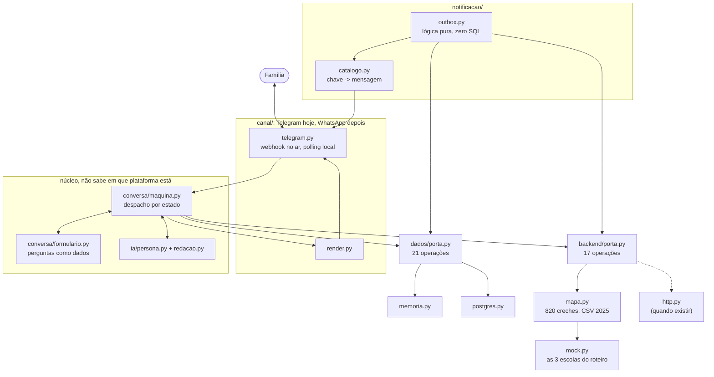

# Arquitetura do Zé Matrícula

O desenho e as restrições que o produziram. O que o sistema faz e por que existe está no
[README](../README.md); o roteiro da conversa, em [ROTEIRO.md](ROTEIRO.md); o porquê de cada
decisão, em [DECISOES.md](DECISOES.md).

## 1. As duas restrições que definem tudo

### 1.1 O flip Telegram → WhatsApp

| | Telegram | WhatsApp Cloud API |
|---|---|---|
| Mensagem proativa | Livre, grátis | Só **template aprovado**, pago (~R$ 0,04 a 0,05) |
| Janela de conversa | Não existe | **24h** após a última mensagem do usuário |
| Botões · lista | Dezenas · livre | **Máx. 3** · **máx. 10 itens** |
| Rótulo de botão | Longo | **20 caracteres** |
| Formatação | MarkdownV2 | Dialeto próprio, por isso **texto puro** nos dois |
| Figurinhas | Nativas, `file_id` | WebP 512×512, só dentro da janela |
| Download de mídia | 20 MB | 100 MB |
| Infra mínima | **Long polling, roda em localhost** | Webhook HTTPS público |
| Começar | `@BotFather`, 2 min | Verificação Meta + templates (~24h cada) |

A consequência que mata projeto ingênuo é esta: "avisar quando o status mudar" é
business-initiated. Fora da janela de 24h isso não pode ser texto gerado por IA, tem que ser
template registrado antes.

A regra que salva o projeto disso: toda mensagem proativa é `(ChaveTemplate, variáveis)` desde
a V1, nunca string pronta. No Telegram a chave vira texto com figurinha; no WhatsApp, o
template. Quem emite o evento não sabe a diferença. E o template só bate na porta: um botão ("Novidade sobre
a vaga do(a) {nome} 👀") abre janela nova de 24h, e a persona vive lá dentro, de graça.

> ⚠️ A Meta anunciou cobrança de serviço/utility dentro da janela de 24h a partir de
> **1º/10/2026**. Reconfirmar antes de projetar custo.

### 1.2 Privacidade: o que vira código

Elegibilidade a ZDR da Anthropic, só o acionável:

- A Messages API (`/v1/messages`) é elegível e a Files API não. Documento vai base64 inline,
  nunca por `client.files.*`.
- Também ficam de fora Batch API, code execution, MCP connector, Managed Agents e Agent
  Skills. Nenhum toca dado de usuário aqui.
- Fable 5 e Mythos 5 são Covered Models, com retenção de 30 dias e sem ZDR. Por isso
  `claude-haiku-4-5`.
- Mesmo com ZDR, conteúdo sinalizado pode ser retido até 2 anos. O controle que vale é a
  minimização, não a política: imagem reduzida a ~1568px, extraída uma vez, guardada
  estruturada e nunca reenviada.

O art. 14 da LGPD exige consentimento específico e destacado para dado de criança. Ele é
tabela de primeira classe aqui, e `EXIGEM_CONSENTIMENTO` torna todo estado que trata dado de
criança inalcançável sem o registro. O art. 11, que cobre saúde, violência, substâncias e
situação prisional, tem consentimento próprio: opcional, nunca bloqueante, e a resposta nunca
é ecoada.

## 2. Visão geral



O núcleo recebe `MensagemEntrada`, devolve `MensagemSaida`, e conversa com duas portas. Ele
não sabe em qual plataforma está, nem qual banco está embaixo, nem de onde vêm os dados do
município.

## 3. Fronteiras: quem é dono de quê

```
        ┌──────────────────────────────────────────────┐
        │  canal/ · conversa/ · ia/ · notificacao/      │  Guilherme
        └───────┬──────────────────────────┬───────────┘
      dados/porta.py               backend/porta.py     ← CONGELADOS
      21 operações                 17 operações
                │                          │
    ┌───────────┴────────────┐  ┌──────────┴───────────────────┐
    │ dados/                 │  │ backend/                     │
    │ memoria.py·postgres.py │  │ mapa.py · mock.py · http.py  │
    │ estado NOSSO           │  │ dados do MUNICÍPIO           │
    └────────────────────────┘  └──────────────────────────────┘
```

A regra não é combinada, é verificada: `make fronteira` varre o pacote e falha se `psycopg`,
`sqlite3`, `SELECT`, `cursor` ou `session` aparecerem fora de `dados/`.

Consequência: `REPOSITORIO=memoria make bot` roda o bot inteiro sem tocar em disco, e a
bateria de persistência roda parametrizada contra as duas implementações.

O backend do município entrega 17 operações em sete grupos: processo (período,
resultado, data de corte, régua), histórico, endereço, oferta, inscrição, consulta e
notificação. A lista completa está em
[`backend/CLAUDE.md`](../creche_bot/backend/CLAUDE.md). Três delas carregam decisão:

- `criterios_do_processo()` devolve a régua vigente. Régua escrita no código quebra na virada
  do ano ([D15](DECISOES.md)).
- `buscar_por_responsavel(cpf)` é pelo CPF do adulto, nunca da criança ([D12](DECISOES.md)).
- `resolver_cep(cep, numero)` é o único caminho para bairro e coordenadas ([D13](DECISOES.md)).

O bot não reordena nada, não recalcula nada e não decide nada. Ele conversa e narra o que o
backend disse.

### 3.1 O que o bot pode dizer sobre uma creche

Quatro números, todos observados:

| | De onde vem |
|---|---|
| Distância | haversine do CEP até a coordenada da unidade |
| Vaga ociosa agora, no grupamento pedido | `vagas_ociosas_geo.csv`. Sobra no Maternal II não serve a Berçário |
| Concorrência do ano passado | `Concorrencia.familias_por_vaga`, com `ano` obrigatório no tipo |
| Chance estimada | `confirmados ÷ demanda de 1ª opção` na unidade, em 2025 |

Ficam de fora pontuação, nota de corte e posição na fila. Não existe campo para elas nos
tipos, então nenhuma tela pode mostrá-las por acidente: a classificação é norma, e só roda
depois do fechamento das inscrições. A chance estimada é honesta sob três condições, o ano
colado no número, o piso e o teto que a mantêm longe de 0% e de 100%, e o fato de a
classificação não estar dentro dela. Ver [D5](DECISOES.md) e [D19](DECISOES.md).

## 4. Os contratos congelados

Seis arquivos, PR próprio para mudar qualquer um:

| Arquivo | O que carrega |
|---|---|
| `canal/tipos.py` | Modelo canônico de mensagem. Os limites do WhatsApp entram como `assert` no construtor, e já rejeitou `Creche Jardim das Flores` (24 chars) e forçou o redesenho do painel de escolas ([D1](DECISOES.md)). `id_externo` nunca é PK: é isso que faz a mesma pessoa migrar de canal sem recomeçar |
| `dominio/tipos.py` | Vocabulário aberto (`Etapa.codigo` é `str` livre), comportamento fechado (`Etapa.tipo` é `Literal` de 6). `Situacao` é o que muda e notifica; `Desfecho` é o que a família vê. Duas guardas valem ouro: `acao_presencial` sem endereço e `convocacao` sem prazo são erro de tipo |
| `dados/porta.py` | 21 operações de persistência |
| `backend/porta.py` | 17 operações do município |
| `notificacao/chaves.py` | 9 chaves de template, e cada uma vira um template submetido à Meta, com ~24h de aprovação. Mudar é grátis agora e caro depois |
| `backend/mock.py` | O espelho executável do contrato: é contra ele que a bateria roda |

## 5. Notificação

```
mudança de status → INSERT em outbox (mesma transação) → worker drena → enviar()
```

Transactional outbox, que aqui é uma tabela e um loop. Nada de Kafka, Celery ou Redis.
`notificacao/catalogo.py` traduz a chave por canal: no Telegram, texto com figurinha
(`ACAO_PRESENCIAL` vira `sendVenue` com o pino); no WhatsApp, template + botão.

`CONVOCACAO` (R2) e `LEMBRETE_CONVOCACAO` (R3) são a correção direta do maior vazamento do
processo: em 2025, 5.519 famílias foram convocadas e perderam a vaga, a maior parte sem saber
que foi chamada. `POR_TIPO_ETAPA` mapeia `TipoEtapa` → `ChaveTemplate` numa tabela, não numa
cadeia de `if`, e um teste garante que todo tipo tem template.

Sobre a lacuna do CRAS: documento entregue lá ainda segue para a creche, e hoje ninguém avisa
quando esse trajeto termina. Quem tem a lacuna é o processo, não o código. O bot diz que o
trajeto existe, quanto demora, e que avisa quando a creche confirmar. Quando a confirmação
existir, entra como mais uma etapa do backend, sem código novo ([D10](DECISOES.md)).

## 6. Privacidade como código

`ia/redacao.py` é o único lugar que fala com a Anthropic, e `tests/test_contratos.py` faz
`grep` na pasta atrás de `.files.`, `messages.batches`, `code_execution` e `beta.agents`. São
dez linhas, e são elas que impedem a regra de virar comentário morto.

| Controle | Hoje |
|---|---|
| Documentos em repouso | Nenhum documento é persistido: extrai, guarda estruturado, descarta os bytes ([D9](DECISOES.md)) |
| Voz | Transcrição local (`faster-whisper`). O áudio não sai da máquina |
| Entrada livre perto de prompt | Delimitada, declarada como dado, resposta filtrada antes de entrar na conversa |
| Logs | Só IDs. O formatador redige segredo em mensagem e em traceback ([D11](DECISOES.md)) |
| Consentimento | Bloqueante, com versão do texto gravada |
| Direito de eliminação | `apagar_tudo(contato_id)` desde a V1, porque incluir depois é bem mais caro |
| Chave da Anthropic | É de quem conversa, guardada na sessão daquele contato ([D20](DECISOES.md)) |

## 7. O caminho até o WhatsApp

O que não muda: `dominio/`, `conversa/`, `ia/`, as chaves do catálogo e o modelo de mensagem.

| Área | Hoje | Depois |
|---|---|---|
| Canal | Telegram | + `canal/whatsapp.py` e os templates aprovados |
| Arquivos | não persistidos | S3/R2 com SSE-KMS, URL pré-assinada |
| Outbox | loop em processo | fila com retry exponencial e DLQ |
| Backend | `BackendMapa` + `BackendMock` | `BackendHTTP` do município |
| Idempotência | id de mensagem | obrigatória, o WhatsApp reentrega webhook |
| Privacidade | termos comerciais padrão | ZDR negociado |

A ordem do flip: (1) verificação Meta Business; (2) submeter os templates do enum
`ChaveTemplate`, ~24h cada, que é o caminho crítico e começa cedo; (3) HTTPS público;
(4) escrever `canal/whatsapp.py`; (5) figurinhas WebP; (6) dois canais em paralelo. Só o
passo 4 é código, e é pequeno, que é o ponto de tudo acima.

## 8. Verificação

```bash
pip install -e ".[dev]"
make test         # tudo, contra as duas implementações de repositório
make contratos    # os seis arquivos congelados
make fronteira    # falha se persistência vazar de dados/
make seguranca    # segredo não sobrevive ao log nem ao traceback
make lint
```

351 testes em ~35s. A persistência roda duas vezes, contra `RepositorioMemoria` e contra o
Postgres, e essa segunda metade só quando há `DATABASE_URL`, sempre no schema `creche_teste`
([BANCO.md](BANCO.md#4-testes)). O resto roda em memória. Em `tests/conversa` o objeto de
teste é o roteiro, e repetir cada turno contra um banco remoto multiplicaria o tempo por cem
sem cobrir uma linha a mais.

O que quebraria em produção sem os testes que existem:

| Teste | Sem ele |
|---|---|
| 4 botões falha; nenhuma tela estoura os limites do WhatsApp | O flip, três meses depois, com o fluxo construído por cima |
| Rótulos abreviados continuam distinguíveis | Família escolhe a creche errada sem saber |
| Persistência não vaza de `dados/` | Refatoração do banco quebra quem mexe no chat |
| `ia/` não usa API fora de ZDR | Documento de criança retido além do necessário |
| Etapa presencial exige endereço; convocação exige prazo | Família mandada à creche sem saber onde; prazo vencendo em silêncio |
| Todo `TipoEtapa` tem template | Etapa nova do backend fica sem notificação |
| Nunca promete vaga, pontuação nem nota de corte | Expectativa falsa numa família esperando creche |
| Todo número derivado sai com o ano; chance nunca é 0% nem 100% | Estimativa sobre 2025 lida como previsão sobre agora |
| Sem consentimento nada é alcançável | LGPD art. 14 |
| Desfecho é a melhor situação entre as opções | Família atendida vendo "cancelado" em 4 das 5 escolhas |
| Resposta sensível nunca é ecoada | Histórico do chat fica no aparelho da família |
| Régua do processo é dado, não código | A virada do ano quebra o bot no meio das inscrições |
| Grupamento sai da idade na data de corte | Família descobrindo no resultado que nunca esteve no processo |
| NIS comprova as duas perguntas; sem ele a inscrição segue | O turno que captura a comprovação virando parede |
| Aviso do trajeto CRAS → creche | Família no escuro depois de entregar documento |
| Dado pessoal não vai junto com a dúvida; cota por contato | PII em prompt; conta da API de quem publicou o bot |
| Chave colada não vira resposta de campo e some do log | A chave da pessoa gravada como nome e ecoada na tela |
| Áudio longo nem é baixado | Polling travado para todo mundo por um áudio de cinco minutos |
| Token não sobrevive ao log nem ao traceback | Quem tem o token controla o bot |

Fim a fim, no Telegram real: `/start` → tela da IA → "Quero inscrever" → consentimento →
blocos 1 a 3 (CPF do responsável `529.982.247-25` traz o cadastro do ano passado) → contato →
resumo → CEP `22710-560` + número → creches em toques → régua → foto do documento →
protocolo. Depois: `/avancar` (as notificações R1 a R4 chegam sozinhas), matar o processo e
subir de novo (a conversa continua), `/status`, `/apagar`. Os CEPs e o CPF são do mock, com
`make roteiro`.

## 9. Fora de escopo, de propósito

| Deixado de fora | Quando adicionar |
|---|---|
| Adapter de WhatsApp | Depois que o Telegram validar o fluxo com famílias reais |
| Alembic e migração versionada | Quando o schema parar de mudar toda semana ([D21](DECISOES.md)) |
| Cofre de documentos cifrado | Quando a creche exigir o arquivo original |
| Fila (Redis/Celery) | Quando o loop da outbox não der conta |
| Figurinhas próprias | Quando houver pack no @Stickers; hoje é emoji |
| Painel que escreve no banco | Quando alguém que não é dev precisar mudar status |
| Retorno CRAS → creche | Depende de processo, não de código ([D10](DECISOES.md)) |
| Previsão de admissão, pontuação, posição na fila | Nunca. Não somos o alocador |

## 10. Fontes

[Retenção de dados na API](https://platform.claude.com/docs/en/manage-claude/api-and-data-retention) ·
[Bots FAQ do Telegram](https://core.telegram.org/bots/faq) ·
[sendVenue](https://core.telegram.org/bots/api#sendvenue) ·
[Preços do WhatsApp Business](https://developers.facebook.com/documentation/business-messaging/whatsapp/pricing) ·
[Mídia no WhatsApp](https://developers.facebook.com/documentation/business-messaging/whatsapp/business-phone-numbers/media) ·
[A regra das 24h](https://www.enchant.com/whatsapp-business-platform-24-hour-rule) ·
[ViaCEP](https://viacep.com.br/) ·
[Nominatim](https://operations.osmfoundation.org/policies/nominatim/)
