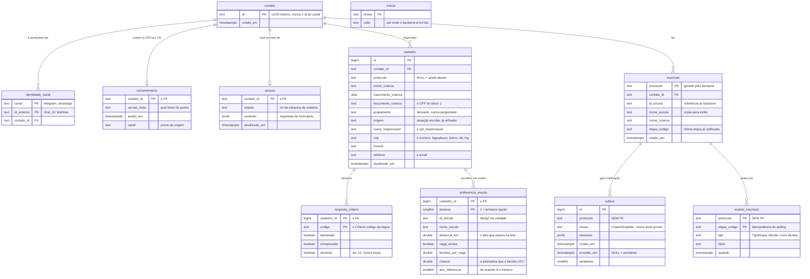

# Modelo de dados

Onze tabelas no schema `creche` do Postgres. O que cada uma guarda, por que existe, e o que
deliberadamente **não** está aqui. Setup em [BANCO.md](BANCO.md).

## O que cada uma resolve

| Tabela | Por que existe |
|---|---|
| `contato` | Um UUID nosso: a identidade da família não é o `chat_id` do Telegram |
| `identidade_canal` | PK `(canal, id_externo)`. **`id_externo` nunca é PK do contato**, e é o que faz a mesma família migrar para o WhatsApp sem recomeçar |
| `consentimento` | Qual **versão do texto** foi aceita, quando e por onde. Quando o texto mudar, dá para saber quem aceitou o quê |
| `sessao` | Onde a conversa parou. `contexto` é `jsonb` porque o formato muda toda semana, e normalizar custaria uma migração por pergunta nova. É o que faz a conversa sobreviver ao restart |
| `cadastro` | O mesmo dado da sessão, em colunas consultáveis, por `conversa/projecao.py` |
| `resposta_criterio` | Código + booleano da régua. **Nunca o texto** |
| `preferencia_escola` | O fato que estava na tela no momento da escolha, **inclusive a chance que a família leu** |
| `inscricao` | O vínculo família ↔ protocolo. `nome_escola` é cópia deliberada, para notificar sem depender do backend estar no ar; `etapa_codigo` é a última etapa **já notificada** |
| `evento_inscricao` | A linha do tempo. PK `(protocolo, etapa_codigo)` torna o polling idempotente |
| `outbox` | Transactional outbox: `enviado_em IS NULL` é a fila, `tentativas` é o teto de retry |
| `marca` | O ponteiro do polling. Não se liga a ninguém, não tem dado pessoal, sobrevive ao expurgo |

**Por que a projeção existe.** `sessao.contexto` é o estado vivo, mas jsonb não responde
"quantas famílias de Curicica pararam antes de escolher a creche". Grava **a cada turno**, não
só no envio: família que abandona no meio deixa rastro, e o abandono é o que interessa medir.
A `UNIQUE` parcial em `protocolo IS NULL` garante um cadastro aberto por contato; os enviados
podem ser vários (1.738 responsáveis inscreveram duas ou mais crianças em 2025).

**As colunas seguem as perguntas do roteiro, uma a uma.** Coluna que nenhuma pergunta preenche
vira barra em zero no painel — parece abandono da família e é desalinhamento nosso. Há teste
que anda o cadastro inteiro e falha se sobrar coluna vazia. Dado de saúde é a exceção
deliberada: nunca vira coluna, só linha em `resposta_criterio`, com o código e o booleano.

**`outbox.chave` guarda uma `ChaveTemplate`, nunca a mensagem pronta.** Se gravássemos a
string renderizada, o flip para o WhatsApp seria impossível.

## O que NÃO está aqui

**Escola, vaga, candidato, etapa** vêm do backend do município. Duplicá-los criaria uma segunda
fonte da verdade que divergiria da prefeitura no primeiro dia. Guardamos só o `id_escola` e uma
cópia do nome para exibir.

**Nota de corte, pontuação e posição na fila** não têm coluna porque não existem no sistema:
a classificação é do município e só roda depois do fechamento ([D5](DECISOES.md)). O que
`preferencia_escola` guarda é o fato que estava na tela, com o `ano_referencia` colado
([D19](DECISOES.md)).

**O documento enviado pela família.** A V1 extrai, guarda o resultado estruturado e descarta os
bytes. Não existe tabela de arquivo, e enquanto isso valer não há o que vazar.

**Histórico de etapas.** `inscricao.etapa_codigo` é sobrescrito; a história vive no backend.

## Escolhas de modelagem

| Decisão | Por quê |
|---|---|
| `timestamptz`, nunca `timestamp` | Sem fuso, "prazo até dia 5" vira ambiguidade num sistema que dá prazo a família |
| `text`, nunca `varchar(n)` | Mesmo desempenho no Postgres; limite artificial só cria migração |
| UUID no `contato`, não sequencial | O id não pode revelar quantas famílias usaram o sistema |
| `jsonb`, não `json` | Binário, indexável, normaliza chave duplicada |
| `bigint identity` na outbox | A ordem da fila é a de chegada |
| Índice parcial em `outbox` | O worker só olha `enviado_em IS NULL` |
| Índice nas FKs | Postgres não cria sozinho, e o expurgo varreria a tabela |

## Segurança e direito de eliminação

As tabelas ficam em **`creche`, não em `public`**: no Supabase o `public` é servido pela Data
API a quem tiver a chave anônima, e estas tabelas guardam nome de criança e CPF. RLS ligada nas
11, sem política; `anon`, `authenticated` e `service_role` sem `USAGE`; TLS obrigatório. O bot
conecta como dono das tabelas ([D21](DECISOES.md)).

`apagar_tudo(contato_id)` roda numa transação só:

1. `DELETE` na `outbox` pelos protocolos daquele contato, **explícito, porque não há FK**
2. `DELETE` na `evento_inscricao` pelos mesmos protocolos, idem
3. `DELETE` no `contato`, e a cascata leva `identidade_canal`, `consentimento`, `sessao`,
   `inscricao`, `cadastro`, e por este as duas filhas

**As duas tabelas sem FK são deliberadas.** `outbox.variaveis` carrega nome de criança e
`evento_inscricao` carrega a história de um protocolo: um `CASCADE` escondido tornaria fácil
esquecer que elas existem. O apagamento é explícito, e há teste que falha se sobrar órfão.

## Uma lacuna conhecida

O consentimento específico para **dado de saúde** é exibido, mas **não registrado**: a tabela
`consentimento` tem uma linha por contato e um só `versao_texto`, e não representa dois
consentimentos distintos. Fechar isso exige método novo em `dados/porta.py`, que é contrato
congelado, e muda em PR próprio. Registrado aqui para não se perder.
