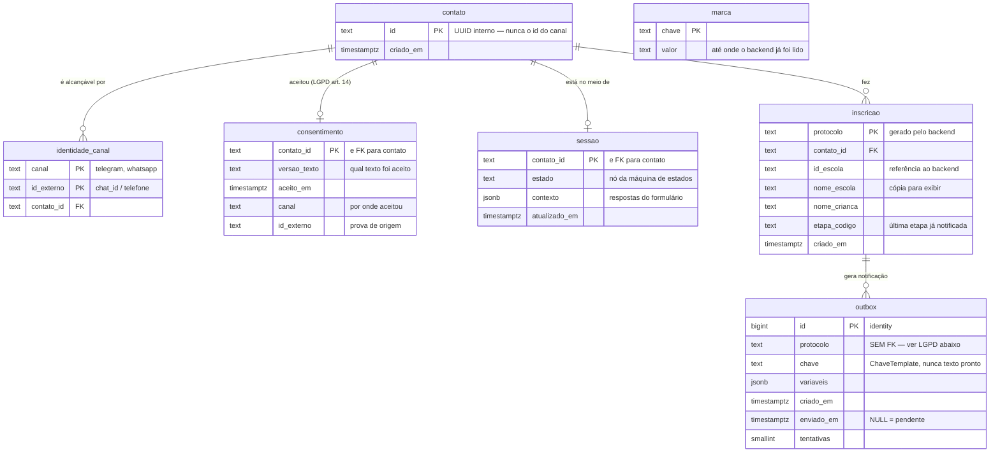

# Modelo de dados

Sete tabelas, no schema `creche` do Postgres. Este documento explica **o que cada uma
guarda e por que ela existe** — e, tão importante quanto, **o que deliberadamente não está
aqui**.

## O diagrama

`marca` não se liga a ninguém de propósito: é o ponteiro do polling, não tem dado pessoal
e sobrevive ao expurgo.

## Tabela por tabela

### `contato` — a pessoa, independente de onde ela fala

Um UUID nosso, e só. Existe para que a identidade da família não seja o `chat_id` do
Telegram.

### `identidade_canal` — como alcançar essa pessoa

Chave primária `(canal, id_externo)`, com `contato_id` como estrangeira. **`id_externo`
nunca é chave primária**, e essa é a decisão que faz o flip Telegram → WhatsApp ser barato:
a mesma família migra de canal sem recomeçar o cadastro, porque o que liga tudo é o UUID
interno. Um `id_externo` como PK travaria a pessoa no canal onde ela começou.

### `consentimento` — a permissão, com prova de origem

Guarda **qual versão do texto** foi aceita, quando, e por qual canal. LGPD art. 14: nada de
dado de criança é tratado antes disso, e `EXIGEM_CONSENTIMENTO` em `conversa/maquina.py`
torna todos os estados inalcançáveis sem o registro.

Guardar a versão importa: quando o texto mudar, dá para saber quem aceitou o quê.

### `sessao` — onde a conversa parou

`estado` é o nó da máquina de estados; `contexto` é `jsonb` com o que a família já
respondeu. É `jsonb`, e não colunas, porque **o formato muda toda semana** durante o
desenvolvimento — normalizar agora custaria uma migração por pergunta nova, e o ganho
(query por campo) ninguém precisa.

É esta tabela que faz a conversa sobreviver ao restart do bot.

### `inscricao` — o vínculo entre a família e o protocolo

`protocolo` vem do backend e é a PK. `id_escola` é **referência ao backend, não FK**: a
escola mora lá, não aqui. `nome_escola` é cópia deliberada, para o bot conseguir escrever
"CEI Girassol" numa notificação sem depender do backend estar no ar.

`etapa_codigo` guarda a **última etapa já notificada** — é ela que faz o worker saber que
não mudou nada e não mandar mensagem repetida.

### `outbox` — a fila de notificações

O padrão *transactional outbox*, em uma tabela e um loop: sem Kafka, sem Celery, sem Redis.
`enviado_em IS NULL` é a fila; `tentativas` é o teto de retry.

**`chave` guarda uma `ChaveTemplate`, nunca a mensagem pronta.** No Telegram vira texto com
figurinha; no WhatsApp, template aprovado pela Meta, que não aceita texto livre. Se
gravássemos a string renderizada, o flip seria impossível.

**`protocolo` não tem FK para `inscricao`** — a única quebra de integridade referencial do
modelo, e é intencional. Um `ON DELETE CASCADE` aqui tornaria fácil esquecer que a fila
também guarda nome de criança dentro de `variaveis`. Sem a FK, o expurgo é obrigado a
apagar por protocolo, explicitamente, e há teste que falha se sobrar linha.

### `marca` — até onde já lemos o backend

Uma linha, duas colunas. O worker pergunta "o que mudou desde X?" em vez de receber
webhook: o backend não precisa nos conhecer, e um restart nosso não perde nem duplica
evento.

## O que NÃO está aqui, e por quê

**Escola, vaga, nota de corte, candidato, etapa.** Tudo isso vem do **backend do
município**, por `creche_bot/backend/porta.py`. Não há tabela `escola` nem `vaga` neste
banco, e isso não é omissão: duplicá-las criaria uma segunda fonte da verdade que
divergiria da prefeitura no primeiro dia. O que guardamos é só o `id_escola` e uma cópia do
nome para exibição.

O mesmo vale para a nota de corte: ela é **referência histórica do ano anterior**, não
previsão, e quem a calcula é o município.

**O documento enviado pela família.** A V1 extrai o dado, guarda o resultado estruturado e
**descarta os bytes**. Não existe tabela de arquivo, e enquanto isso valer, não há o que
vazar. Quando a creche exigir o original, ele nasce cifrado, com `expira_em` e job de
expurgo — desenho em `creche_bot/dados/CLAUDE.md`.

**Histórico de etapas.** `inscricao.etapa_codigo` é sobrescrito. O histórico de verdade
vive no backend, que é a fonte da situação.

## Escolhas de modelagem

| Decisão | Por quê |
|---|---|
| `timestamptz`, nunca `timestamp` | Sem fuso, "prazo até dia 5" vira ambiguidade num sistema que dá prazo a família |
| `text`, nunca `varchar(n)` | Mesmo desempenho no Postgres; limite artificial só cria migração |
| `bigint identity` na outbox | Sequencial, sem fragmentação de índice — e a ordem da fila é a de chegada |
| UUID no `contato`, não sequencial | O id não pode revelar quantas famílias usaram o sistema |
| `jsonb`, não `json` | Binário, indexável, e normaliza chave duplicada |
| Índice parcial em `outbox` | O worker só olha `enviado_em IS NULL`, que vira minoria das linhas |
| Índice nas FKs | Postgres não cria sozinho, e o expurgo em cascata varreria a tabela |

## Segurança do schema

As tabelas ficam em **`creche`, não em `public`**. No Supabase o `public` é servido pela
Data API a quem tiver a chave anônima — e essa chave costuma acabar no front. Estas tabelas
guardam nome de criança e CPF.

- Schema fora da lista de exposição: **não alcançável** pela Data API
- RLS ligada nas 7 tabelas, sem política nenhuma
- `anon`, `authenticated` e `service_role` sem `USAGE` no schema
- TLS obrigatório na conexão

O bot conecta como dono das tabelas, que é quem a RLS não bloqueia. Detalhes e verificação
em [BANCO.md](BANCO.md).

## Direito de eliminação (LGPD art. 18)

`apagar_tudo(contato_id)` roda numa transação só:

1. `DELETE` na `outbox` pelos protocolos daquele contato — **explícito, porque não há FK**
2. `DELETE` no `contato` — e as FKs em cascata levam `identidade_canal`, `consentimento`,
   `sessao` e `inscricao`

Sobra `marca`, que não tem dado pessoal. Três testes cobrem isso, sendo um deles
especificamente o órfão na outbox.

## Uma lacuna conhecida

O consentimento específico para **dado de saúde** (deficiência, TGD/TEA, altas habilidades
— LGPD art. 5º II e art. 11) é **exibido, mas não registrado**. O texto destacado aparece
antes da pergunta e "Prefiro não dizer" é sempre uma opção (`conversa/formulario.py`,
`aviso="sensivel"`), mas a tabela `consentimento` tem uma linha por contato e um só
`versao_texto` — ela não consegue representar dois consentimentos distintos.

Fechar isso exige um método novo em `dados/porta.py`, que é **contrato congelado**: PR
próprio, revisado por todas as trilhas. Está registrado aqui para não se perder.
