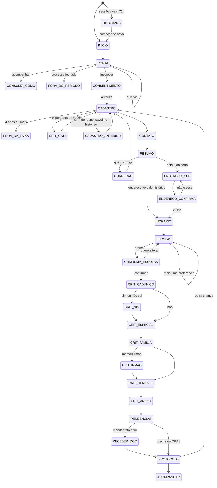

# Roteiro do Zé Matrícula — estados e telas

Mapa entre [`script-chatbot-ze-matricula.md`](script-chatbot-ze-matricula.md) e os
estados do código.

Quem mexe no **texto** edita `creche_bot/ia/persona.py` e `creche_bot/conversa/formulario.py`.
Quem mexe no **fluxo** edita `creche_bot/conversa/passos/`.

## O fluxo de inscrição

## Bloco a bloco

| Roteiro | Estado | Arquivo | O que importa |
|---|---|---|---|
| 0 · Boas-vindas | `INICIO`, `PORTA` | `passos/entrada.py` | Três portas: inscrever, acompanhar, dúvida. A do meio serve inclusive para quem se inscreveu pelo site |
| 0.1 · Retomada | `RETOMADA` | `passos/entrada.py` | Sessão viva por 72h não recomeça — diz onde parou e oferece continuar |
| — · Fora do período | `FORA_DO_PERIODO` | `passos/entrada.py` | Fora da janela, inscrever não é opção. Oferece o aviso de abertura |
| — · Consentimento | `CONSENTIMENTO` | `passos/entrada.py` | Gate. LGPD art. 14. Não está no roteiro; sem ele nada pode ser gravado |
| 1 · Pesquisa inicial | `CADASTRO` | `formulario.py::CADASTRO` | CPF e nascimento da criança. Nenhum dos dois é obrigatório |
| 2 · Sobre a vaga | `CADASTRO` | `formulario.py::CADASTRO` | Origem escolar, matrícula e a pergunta de saúde |
| 3 · Dados pessoais | `CADASTRO` | `formulario.py::CADASTRO` | Criança, filiação e responsável. Lista de `Campo`, uma pergunta por mensagem |
| — · Cadastro anterior | `CADASTRO_ANTERIOR` | `passos/responsavel.py` | Dispara em 27,9% no CPF do responsável. Aproveita endereço e auto-valida "esperou na fila" |
| — · Dado sensível | `CRIT_GATE` | `passos/criterios.py` | Consentimento do art. 11, pedido uma vez e válido para o resto da conversa |
| — · Fora da faixa | `FORA_DA_FAIXA` | `passos/formulario_passo.py` | Creche vai até 3 anos e 11 meses. Único bloqueio além do consentimento |
| 4 · Contato | `CONTATO` | `formulario.py::CONTATO` | O canal de convocação. É a correção direta dos 7,7% que perdem a vaga |
| 5 · Resumo | `RESUMO`, `CORRECAO` | `passos/resumo.py` | Repete o declarado. Nunca pontuação, nunca resposta sensível |
| 6 · Escolas | `ENDERECO_CEP`, `ENDERECO_CONFIRMA`, `HORARIO`, `ESCOLAS` | `passos/endereco.py`, `passos/escolas.py` | CEP + número, nunca bairro digitado. Ordem montada em toques |
| 7 · Confirmação | `CONFIRMA_ESCOLAS` | `passos/escolas.py` | A lista final, na ordem, antes de valer |
| — · Régua de prioridade | `CRIT_*` | `passos/criterios.py` | Não está no roteiro v1, e é o que captura o NIS. Roda depois do bloco 7, porque é ela que gera a pendência do bloco 8 |
| 8 · Documentação | `PENDENCIAS`, `RECEBER_DOC` | `passos/pendencias.py` | Lista condicional ao que foi declarado. WhatsApp, creche ou CRAS |
| 8 · Protocolo | `PROTOCOLO` | `passos/pendencias.py` | Oferece a segunda criança: 1.738 responsáveis fizeram isso em 2025 |
| C · Acompanhar | `CONSULTA_*` | `passos/consulta.py` | Ver abaixo |
| — · Pós-inscrição | `ACOMPANHAR` | `passos/consulta.py` | Entrada do `/status`. Comportamento vem de `etapa.tipo`, nunca do `codigo` |

## Onde o código não segue o roteiro, e por quê

| Roteiro pede | O que o bot faz | Por quê |
|---|---|---|
| Bloco 1 busca cadastro pelo CPF da **criança** | Busca pelo CPF do **responsável**, perguntado no bloco 3 | `backend/porta.py` é contrato congelado e só tem `buscar_por_responsavel` |
| Bloco 6 aceita "CEP **ou bairro**" | Só CEP + número | Bairro digitado gerou 1.608 grafias para ~925 bairros. Ver [D13](DECISOES.md) |
| Bloco 6 mostra "nota de corte: X pontos" | Distância, vaga ociosa e concorrência do ano passado | A classificação só roda depois do fechamento: no momento da conversa esse número não existe. Ver [D5](DECISOES.md) |
| Bloco 5 exibe "necessidades especiais" no resumo | Guarda, mas não repete | Dado de saúde ecoado num histórico que fica no aparelho da família. LGPD art. 11 |
| Bloco 8 sempre pergunta como entregar os documentos | Só quando há documento pendente | Sem pendência, mandar a família procurar papel é fazê-la voltar para casa sem resolver |
| — | Pergunta o horário da vaga | `escolas_proximas()` filtra por horário; sem ele a oferta não sai |

## O bloco C — acompanhar

Leitura pura. Não toca no fluxo de inscrição, e é a extensão de menor risco e maior
alcance do projeto: alcança as ~62 mil famílias que se inscreveram pelo portal.

| Roteiro | Estado |
|---|---|
| C.1 · Identificação | `CONSULTA_COMO` → `CONSULTA_NUMERO` (número + nascimento) ou `CONSULTA_NOME` (nome + nascimento + filiação) |
| C.2 · Mais de uma criança | `CONSULTA_ESCOLHER` — 2,8% dos casos |
| C.3 · Situação | Sete telas, uma por `EstadoInscricao`. `CONSULTA_CONFIRMAR` quando é convocação |
| C.3b · Pendência na espera | `CONSULTA_PENDENCIA` → `CONSULTA_NIS` |
| C.4 · O que fazer daqui | `CONSULTA_ACOES` → `CONSULTA_DOC`, `CONSULTA_TELEFONE` |
| C.5 · Ativar avisos | `CONSULTA_AVISOS` — o turno mais valioso do fluxo |
| C.6 · Não encontrou | `CONSULTA_NAO_ACHOU` — três tentativas, depois atendente |

Os **dois caminhos de busca são obrigatórios**: são as rotas `/ConsultaInscricao` e
`/ConsultaCreche` do portal. O segundo existe porque nem todo mundo guarda o número, e
porque há criança sem filiação registrada na certidão.

**A regra crítica:** o que aparece é o `Desfecho` — a melhor situação entre as opções —
nunca o status bruto por opção. Ver [D14](DECISOES.md).

## A régua é montada em tempo de execução

A régua muda todo ano: entre 2023 e 2024 só 3 das 13 perguntas sobreviveram e o teto caiu
de 465 para 100 pontos. Por isso ela **não** é uma tupla de `Campo` como os blocos 1 a 4 —
o conteúdo vem de `backend.criterios_do_processo()`, agrupado por `Criterio.grupo`
(`8.1` a `8.4`), e `criterios.py` só define a **forma** de cada turno. Ver
[D15](DECISOES.md).

A pergunta de educação especial do grupo `8.2` **não é refeita**: o bloco 2 do roteiro já
perguntou isso, e o resultado alimenta a régua direto.

## As duas perguntas que o bot não faz

| Pergunta da régua | De onde vem |
|---|---|
| Esperou na fila no ano anterior | `CadastroAnterior.esperou_na_fila` — e já sai **validada**, porque a fonte é o banco |
| Responsável menor de 18 anos | Data de nascimento do responsável, capturada no bloco 3 |

As duas são perguntadas no portal hoje e a comprovação falha em cerca de 88% dos casos.
Auto-preencher converte declaração em pontuação.

Mesma lógica para grupamento, bairro, logradouro, coordenadas, polo e distância: são
derivados. Perguntar à família o que o sistema já sabe é o desenho errado.

## Comandos globais

Rodam antes de qualquer passo, em `maquina.py`.

| Comando | Efeito |
|---|---|
| `/start` | Zera a sessão e recomeça, guardando a inscrição que já existe |
| — | O mesmo vale para sessão expirada: recomeça limpa, mas o número sobrevive |
| `/status` | Salta para o fluxo de consulta (bloco C) |
| `/ajuda` | Lista os comandos |
| `/apagar` | `repo.apagar_tudo()` — direito de eliminação, LGPD art. 18 |
| `/avancar` | **Só com o mock**: empurra uma etapa para demonstrar a notificação |

## Fora do roteiro: voz e dúvida solta

Antes de qualquer decisão, `maquina.processar()` faz duas coisas:

1. **Áudio vira texto** (`ia/transcricao.py`, local). Quem falou segue o mesmo caminho de
   quem digitou, e nenhum passo sabe que existe áudio.
2. **Pergunta solta é respondida sem mudar o estado** — perguntar não faz perder o lugar na
   fila. Com cota de 8 por hora por contato e o texto do cidadão tratado como dado, nunca
   como instrução. Ver [D17](DECISOES.md).

## Regras que valem em todo passo

| Regra | Onde é cobrada |
|---|---|
| Uma pergunta por mensagem | `formulario.py`, um `Campo` por vez |
| Exceção: os checklists de 8.3 e 8.4 são deliberados | 5 perguntas invasivas em 5 turnos, para 13,6% de acerto, é péssimo desenho |
| Máx. 3 botões, 10 itens de lista, rótulo de 20 chars | `MensagemSaida.__post_init__` |
| Texto puro, sem markdown | `canal/render.py` não manda `parse_mode` |
| Eco do que foi recebido | `Campo.eco` — vale para CPF, nome e telefone |
| **Nunca ecoar resposta sensível** | O histórico fica no aparelho da família |
| Guardamos normalizado, mostramos legível | `formulario.formatar()` |
| Nada bloqueia além do consentimento e da faixa etária | Documento que falta vira pendência, não parede |
| Confiança baixa pede de novo, não grava | `DadosExtraidos.confianca == "baixa"` |
| Três falhas no mesmo campo → atendente | `formulario_passo._errar` |
| Sem consentimento não passa do início | `maquina.EXIGEM_CONSENTIMENTO` |
| **Consultar não exige o consentimento de inscrição** | É direito de acesso (art. 18), não tratamento novo — e exigi-lo barraria justamente quem se inscreveu pelo site. O consentimento de comunicação é pedido no C.5 |
| Nunca prometer vaga, pontuação ou posição na fila | `persona.SISTEMA`, `redacao._promete`, e teste que varre o roteiro |
| Estado persiste; restart não perde conversa | `repo.salvar_sessao()` a cada turno |
| Conversa que cai não vira inscrição duplicada | `dados["chave_idempotencia"]` — ver [D16](DECISOES.md) |

## O que o bot mostra sobre uma creche

Só fato verificável: **distância**, **vaga ociosa agora** e **concorrência do ano
passado**, rotulada como passado. Nunca nota de corte — a classificação só roda depois do
fechamento das inscrições, então no momento da conversa ela não existe — e nunca posição
na fila. Ver [D5](DECISOES.md).

## Para testar cada caminho

Com o `BackendMock`:

| Caminho | Como |
|---|---|
| Histórico **achou** | CPF do responsável `529.982.247-25` |
| Histórico **não achou** | Qualquer outro CPF válido |
| CEP que resolve | `22710-560`, `22775-003` ou `20220-030` — com número |
| CEP que não resolve | Qualquer outro |
| Criança fora da faixa | Nascimento com 4 anos ou mais na data de corte |
| Escola com vaga aberta | `EDI Leila Diniz` — sempre em primeiro |
| Escola sem histórico comparável | `EDI Leila Diniz` tem `concorrencia=None` |
| Processo fechado | `BackendMock(processo_aberto=False)` |
| NIS válido | Qualquer 11 dígitos — comprova `cadunico` e `bolsa_familia` de uma vez |
| Documento ilegível | Arquivo com menos de 1 KB |
| Consulta, os 7 desfechos | Números `2026-0847213` a `2026-0847277` — um por estado |
| Notificação R1 a R4 | `/avancar` depois de concluir a inscrição |

## Cada estado tem duas portas

`PASSOS[estado]` **consome** a resposta que chegou. `ENTRADAS[estado]` **desenha** a tela
pela primeira vez. Correção (bloco 11) e retomada (bloco 0.1) usam a segunda, via
`maquina.entrar()`.

Sem essa separação, voltar a um bloco engole a próxima mensagem da família: ela responderia
uma pergunta que nunca foi feita. Nem todo estado precisa de entrada própria — `entrar()`
cai no handler normal quando não há uma.
