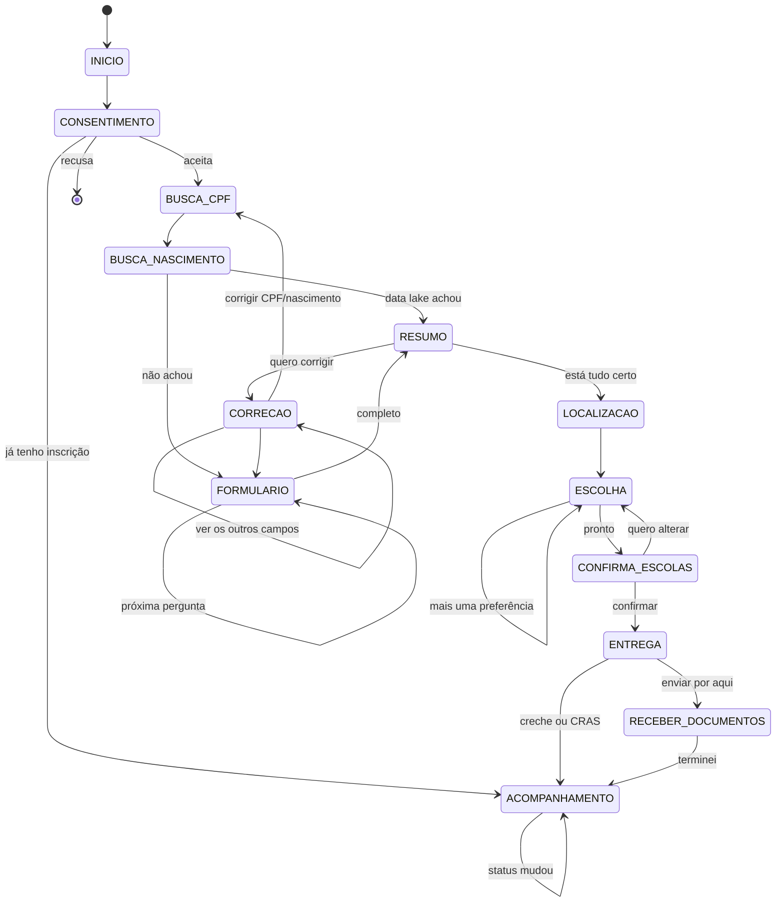

# Roteiro do Zé Matrícula — estados e telas

Mapa entre o roteiro de conversa e o código. Quem for mexer no texto edita
`creche_bot/ia/persona.py` e `creche_bot/conversa/formulario.py`; quem for mexer no fluxo
edita `creche_bot/conversa/passos/`.

## Bloco a bloco

| Roteiro | Estado | Arquivo | Observação |
|---|---|---|---|
| 0 · Boas-vindas | `INICIO`, `CONSENTIMENTO` | `passos/busca.py` | Consentimento LGPD art. 14 no mesmo balão da saudação. "Já tenho inscrição" salta para o status sem consentir nada |
| 1 · Pesquisa inicial | `BUSCA_CPF`, `BUSCA_NASCIMENTO` | `passos/busca.py` | CPF **e** data: CPF sozinho traria a criança errada |
| 2 · Sobre a vaga | `FORMULARIO` | `formulario.py` | 4 origens não cabem em 3 botões → duas perguntas. Matrícula tem `Campo.escape` ("Não sei agora") |
| 3 · Dados pessoais | `FORMULARIO` | `formulario.py` | `pergunta_alt` troca o texto quando não há filiação na certidão. A data de nascimento do responsável marca os critérios de prioridade sem perguntar — `criterios_prioridade()` |
| 4 · Contato | `FORMULARIO` | `formulario.py` | Segundo contato e e-mail só são perguntados se a pessoa disser que tem |
| 5 · Resumo | `RESUMO`, `CORRECAO` | `passos/resumo.py` | Correção usa **lista** (até 10), não botões — e pagina em 9 + "ver os outros", porque são até 14 campos |
| 6 · Escolas | `LOCALIZACAO`, `ESCOLHA` | `passos/escolas.py` | Ordem montada em toques — ver [D6](DECISOES.md) |
| 7 · Confirmação | `CONFIRMA_ESCOLAS` | `passos/escolas.py` | |
| 8 · Documentação | `ENTREGA`, `RECEBER_DOCUMENTOS` | `passos/entrega.py` | Três caminhos; o do CRAS é honesto sobre a lacuna. Link do painel é **mock** (`entrega.PAINEL`) até o backend real devolver o dele |
| — · Acompanhamento | `ACOMPANHAMENTO` | `passos/acompanhamento.py` | Comportamento vem de `etapa.tipo`, nunca do `codigo` |

## Comandos globais

Rodam antes de qualquer passo, em `maquina.py`.

| Comando | Efeito |
|---|---|
| `/start` | Zera a sessão e recomeça |
| `/status` | Salta para `ACOMPANHAMENTO` |
| `/ajuda` | Lista os comandos |
| `/apagar` | `repo.apagar_tudo()` — direito de eliminação, LGPD art. 18 |
| `/avancar` | **Só com o mock**: empurra uma etapa para demonstrar a notificação |

## Regras que valem em todo passo

| Regra | Onde é cobrada |
|---|---|
| Uma pergunta por mensagem | `formulario.py`, um `Campo` por vez |
| Máx. 3 botões, 10 itens de lista, rótulo de 20 chars | `MensagemSaida.__post_init__` |
| Texto puro, sem markdown | `canal/render.py` não manda `parse_mode` |
| Eco do que foi recebido | `Campo.eco`, com valor formatado para leitura |
| Guardamos normalizado, mostramos legível | `formulario.formatar()` |
| Confiança baixa pede de novo, não grava | `passos/entrega.py` |
| Sem consentimento não passa do início | `maquina.EXIGEM_CONSENTIMENTO` |
| Nunca prometer vaga | `persona.SISTEMA` + teste que varre o roteiro |
| Estado persiste; restart não perde conversa | `repo.salvar_sessao()` a cada turno |

## Para testar cada caminho

| Caminho | Como |
|---|---|
| Data lake **achou** | CPF `111.222.333-44` + nascimento `18/03/2024` |
| Data lake **não achou** | Qualquer outro CPF |
| CPF certo, data errada | `111.222.333-44` + outra data → não traz a criança errada |
| Documento ilegível | Enviar arquivo com menos de 1 KB |
| Escola sem vaga | `EDI Paulo Freire` tem 0 vagas e nunca aparece no painel |
| Notificação | `/avancar` depois de concluir a inscrição |
